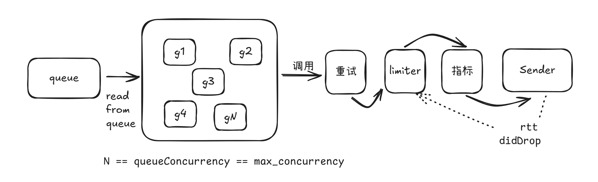

## 1. 背景 (Background)

在可观测性系统中，数据流量通常呈现出极度的**不均匀性**。例如，白天业务高峰期的流量往往远超夜间，或者在进行全链路压测时，流量会瞬间激增至平时的数倍。这种流量的剧烈波动给固定并发模型带来了两难困境：

* **低负载场景**：当流量较小时，若并发限制设置过低，无法充分利用后端的处理能力，导致数据发送延迟和资源浪费。
* **高负载场景**：当流量爆发时，若并发限制设置过高，瞬间涌入的请求会导致后端服务压力过大，甚至引发雪崩效应（Crash）。

鉴于此，为了实现数据**高效且稳定**的传输，我们在发送端（采集端）引入了**自适应并发控制算法**。该机制能够根据实时网络状况和后端响应反馈，动态调整最大并发请求数（Limit），从而在保护后端系统稳定性的同时，最大化数据吞吐量。

---

## 1. 架构设计 (Architecture)

在原有的发送逻辑之上，引入了一个独立的 **Limiter（限流）层**。其核心工作流程如下：

1.  **准入控制**：采用类似经典限流器的模式。每次执行 `send` 操作前，请求必须阻塞等待，直到成功获取令牌（Permit）；操作结束后释放令牌。
2.  **指标反馈**：Sender 端在请求完成后，必须返回两个关键指标：**RTT** (往返时延) 和 **didDrop** (是否被丢弃/限流)。
3.  **动态调整**：Limiter 根据反馈的 RTT 和丢包情况，实时动态调整并发限制数（Limit）。

> **⚠️ 注意**：
> 现有架构通过预先建立“并发池”来实现异步发送。若并发池容量小于 Limiter 计算出的 Limit 值，会导致实际 Inflight（在途）请求数受限于池大小，从而无法达到最大吞吐量。
> 因此，**当开启自适应并发功能时，系统将忽略 `queue_concurrency` 配置项**，完全交由 Limiter 接管并发控制。

---

## 2. 核心算法 (Core Algorithms)

### 2.1 Vegas 算法

该算法起源于 [TCP Vegas][1]。其核心思想是：只要服务内部队列（或线程池）未满，请求的处理延迟通常保持稳定；一旦延迟增加，说明队列开始积压。

#### 理论基础：Little's Law
基于排队论中的重要公式 **Little's Law**：

$$
L = \lambda W
$$

其中：
* $L$：队列长度 (Queue Size)
* $\lambda$：请求到达速率 (Arrival Rate)
* $W$：等待时间 (此处指 RTT)

利用此公式，我们可以通过 RTT 估算对端服务内部的队列积压情况，进而判断服务端压力并动态调节 Limit。

#### 算法流程
1.  **计算积压队列大小**：
    $$queue\_size = limit \times (1 - \frac{rttNoLoad}{rtt})$$
2.  **动态调整**：
    * 当 `queue_size < alpha` (一般为 3) 时，**增加 Limit**。
    * 当 `queue_size > beta` (一般为 6) 时，**减少 Limit**。

#### 生产环境优化 (Optimizations)
在原始 Vegas 实现的压测中，我们发现由于网络环境中的 RTT 存在大量噪点，导致 Limit 数值剧烈波动，且错误率较高。

为了抑制噪音，参考 [Uber Engineering Blog][4] 及 [Netflix Gradient2][5] 的实现，我们进行了以下关键优化：

* **RTT 评估窗口化**：
    不再对每个请求单独评估，而是改为**每隔 2 秒**或**每累积 100 个请求**触发一次评估。
* **RTT 平滑采样**：
    * **采样**：对窗口内的 RTT 值取 **P95** 分位值。
    * **平滑**：应用滑动中值算法，并结合 [EWMA (指数加权移动平均)][2] 算法，计算出一个平滑且贴近实况的 `RTTSampled`。
* **基准值 (RTTNoLoad) 动态重置**：
    * **重置时机**：**每隔 30 秒**或**每 1000 个请求**。
    * **采样策略**：取窗口内 RTT 的 **P10** 分位值作为新的基准。

通过上述“批量处理 + 统计平滑”的策略，有效过滤了偶发抖动，使曲线更加平稳。

#### 用户模式
鉴于算法参数（如 alpha, beta, RTT 分位值）较多，为了简化配置，系统预设了两种模式：
* **默认模式 (Default)**：追求平衡，在保证一定稳定性的前提下，尽可能最大化吞吐量。
* **稳定模式 (Stable)**：追求绝对的稳定性，对波动的容忍度极低，吞吐量可能会略低于默认模式。

### 2.2 AIMD 算法

[AIMD (Additive Increase/Multiplicative Decrease)][3] 同样源于 TCP 拥塞控制理论。这也是同类开源产品 [Vector][6] 所采用的策略。

#### 算法原理
* **加性增 (Additive Increase)**：当 RTT 稳定时，Limit 线性缓慢增长（如 +1）。
* **乘性减 (Multiplicative Decrease)**：当 RTT 变差或出现背压时，Limit 按比例快速削减（如 $\times 0.9$）。

#### 选型结论
尽管 AIMD 实现简单，但在压测中表现不佳。
* **问题**：流量呈现明显的“锯齿状”波动，错误率较高。
* **恶化场景**：当多个 Sender 同时开启自适应并发时，竞争加剧导致波动更加剧烈。
* **原因**：AIMD 的本质决定了它必须不断试探由“增加”带来的延迟边界，直到收到负反馈才“急刹车”，这种机制难以在对延迟敏感的系统中维持平稳的高吞吐。

**结论**：经过对比，Vegas 算法在配合平滑优化后，表现远优于 AIMD，因此作为本系统的核心策略。

[1]: https://en.wikipedia.org/wiki/TCP_Vegas
[2]: https://en.wikipedia.org/wiki/Exponential_smoothing?uclick_id=17aeb259-ae1d-4581-9ee7-0f00e46591b8
[3]: https://en.wikipedia.org/wiki/Additive_increase/multiplicative_decrease
[4]: https://www.uber.com/en-JP/blog/cinnamon-auto-tuner-adaptive-concurrency-in-the-wild/
[5]: https://github.com/Netflix/concurrency-limits/blob/main/concurrency-limits-core/src/main/java/com/netflix/concurrency/limits/limit/Gradient2Limit.java#L233
[6]: https://vector.dev/blog/adaptive-request-concurrency/