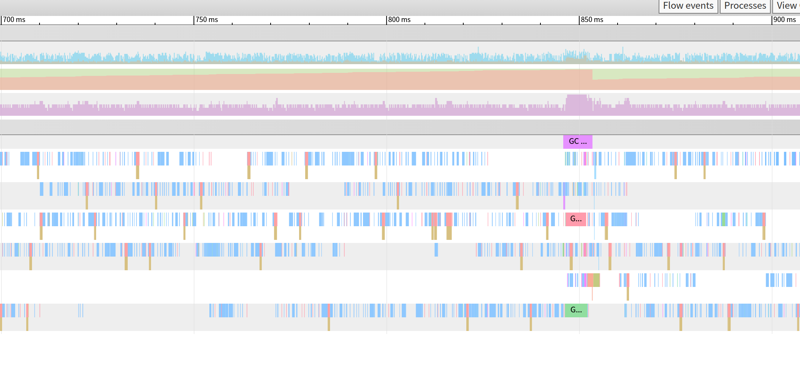
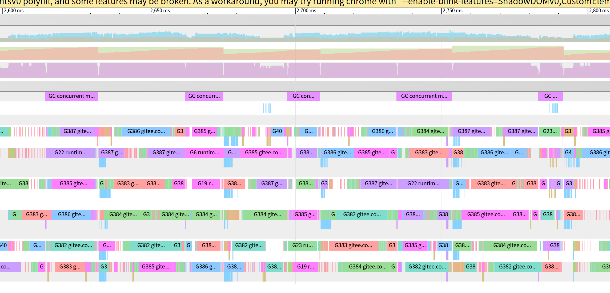

## 🛠️ 课前小贴士：Go Tool Trace 快捷键

在进行性能分析前，掌握 `go tool trace` 的视图操作非常重要。以下是常用的快捷键：

> - **缩放视图**：`w` (放大), `d` (缩小) 或按住 `Alt` + 鼠标滚轮。
> - **移动视图**：`a` (左移), `s` (右移)。

## 问题背景

### 场景描述

在 Agent 数据采集任务中，我们采用经典的 Pipeline 架构：Readers -> Transformers -> Senders。

其中 Transformer（数据转换）环节支持并行计算。

### 遇到问题

尽管启用了并行计算，但在高负载场景下，观察到 Agent 的 **CPU 使用率始终处于低位**（上限仅达到 150%），未能跑满多核 CPU 的性能。

------

## 深度分析与诊断

为了定位 CPU 上不去的原因，我们使用了 Profile 和 Trace 工具进行分析：

### 诊断数据

1. **Profile 分析**：

   - `chanrecv` (通道接收) 和 `chansend` (通道发送) 的 CPU 占用率显著偏高（约占 **10%**）。这说明大量 CPU 时间消耗在调度通信上，而非实际计算上。

2. **Goroutine 分析**：

   - 系统在运行时产生了**数万个 Goroutine**。过多的 Goroutine 导致了巨大的调度开销。

3. **Trace 分析（关键证据）**：

   - **P (Processors) 大量留白**：Trace 图显示 P 只有极少部分时间是满载的，大部分时间处于空闲或阻塞状态。

   - **Running 状态稀缺**：同一时刻，往往只有一个 Goroutine 处于 Running 状态。

     

### 问题源码分析

查看问题代码，可以最初的实现思路是：在 `Transformers` 环节内部，根据 CPU 核心数 $N$ 创建一批 Goroutine，将一个 Batch 的数据拆分为 $N$ 份并行处理，最后再汇总。

乍一看，这种实现并无明显问题，并且 Benchmark 测试也是符合预期的。然而，由于该实现存在多处同步操作（示例代码中已标记）且会创建大量 goroutine ，当调用方频繁调用 `Transforms` 方法时，导致CPU时间浪费在了上下文切换（ Context Switch ）和同步等待上面

```go
package parallel

// DataList 代表一批数据
// 流程：t1 -> t2 -> t3
func (t *Transformer) Transforms(data models.DataList) plugins.TransformResult {
    // ...

    // 1. 启动消费者：创建 N 个 Goroutine 处理数据
    for i := 0; i < numRoutine; i++ {
        t.wg.Add(1)
        j := i
        go func ()  {
			defer wg.Done()
			// 这里的 doTransform 处理一部分切片数据
            t.doTransform(j, dataPipeline, resultChan)
		}()
    }

    // 2. 启动等待者：等待所有任务完成关闭结果通道
    go func ()  {
        t.wg.Wait() // 同步操作
        close(resultChan)
    }()

    // 3. 启动生产者：将拆分后的数据写入 Pipeline channel
    go func ()  {
        defer close(dataPipeline)
        for idx, d := range data {
            // 同步操作
            dataPipeline <- transformInfo{
                CurData: d,
                Index:   idx,
            }
        }
    }()

    // 4. 主流程：从结果 Channel 收集数据
    for resultInfo := range resultChan { // 同步操作
        transformResultSlice[resultInfo.Index] = resultInfo
    }

    // ...
}
```


## 优化方案：Worker Pool 模式


### 优化思路


将并发模型从“函数内部并发”改为“**组件级并发**”。

- 不再为每批数据的处理临时创建 Goroutine。
- 采用 **Worker Pool (工作池)** 模式：预先启动固定数量的 Worker Goroutine。
- 每个 Worker 直接处理**整个 Batch** 的数据，减少 Channel 通信频率。

### 优化后的代码

```go
package runners	

type parallelRunner struct {
	// ...
}

// ...

func (r *parallelRunner) runTransformer(src <-chan models.DataList, dst chan<- models.DataList) error {
    // ...

    // ✨ 核心优化：预先创建 N 个固定 Worker，N 通常等于 runtime.GOMAXPROCS
    r.transformerWg.Add(r.TransformerParallel)
    for i := 0; i < r.TransformerParallel; i++ {
        clonedTransformer := r.RunningTransformers.Clone()
        go func(ts *running.RunningTransformers) {
            defer r.transformerWg.Done()
            
            // Worker 持续消费 Channel 里的数据
            for batch := range src {
                if len(batch) == 0 {
                    continue
                }
                r.transformTotalInNumStat.Incr(int64(len(batch)))

                // ✨ 优化点：单次处理整个 Batch
                // 不再在 Transform 内部拆分，减少 Goroutine 创建和销毁开销以及同步开销
                batch = ts.Transform(batch)

                r.transformTotalOutNumStat.Incr(int64(len(batch)))
                dst <- batch
            }
        }(clonedTransformer)
    }
    return nil
}
```


## 优化结果

经过调整为 Worker Pool 模式后，再次进行 Trace 分析：

- **Trace 视图**：P 的轨道明显变得更为稠密，没有了大量的留白。

  

- **吞吐量**：由于减少了 Channel 锁竞争和 Goroutine 创建销毁开销，数据处理吞吐量大幅上涨。

## 总结

在处理高吞吐数据流时，**并发粒度的控制**至关重要。

1. 避免在热点代码路径中频繁创建/销毁 Goroutine。
2. 利用 Worker Pool 复用 Goroutine。
3. 通过 Trace 工具直观地观察 P (Processor) 的调度情况，是定位“假并发”问题的最有效手段